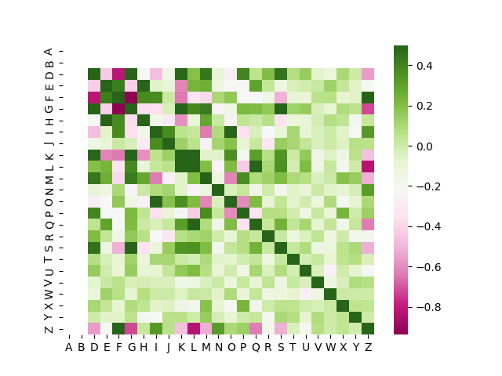

# Evaluation finale
## Simon HEBAN

# Sommaire
- [Analyse des données](#analyse-des-données)
  - [Matrice de corrélation](#matrice-de-corrélation)
  - [Type de problème (Classification)](#type-de-problème-classification)
- [Suppressions de caractéristiques](#suppressions-de-caractéristiques)
  - [Résultat lié à cette suppression](#résultat-lié-à-cette-suppression)
- [Résultat (Partie Apprentissage & Conseils)](#résultat-partie-apprentissage--conseils)
    - [KNN Algorithm](#knn-algorithm)
    - [Tree Algorithm](#tree-algorithm)
    - [Neuronal Network Algorithm](#neuronal-network-algorithm)
- [Sortie du programme](#sortie-du-programme)

# Analyse des données

Après analyse des données du fichier [dataCCfinal.csv](data/dataCCfinal.csv) il y a:
 - 101 entrées
 - 26 colonnes
 
Les colonnes A et B sont des nombres qui ne varie pas donc ne serviront pas à apprendre, on peut donc les retirer.

*La colonne Z sera la colonne a prédire !*

On constate aussi que les exemples ne sont pas homogènes et que certaines classes seront difficiles à apprendre. 
Les classes 6 (8 exemples), 3(5 exemples) et 5(4 exemples)

On remarque que la classe C est une classe comportant des caractères alphabétique il va donc falloir l'encoder pour pouvoir l'utiliser !

## Matrice de corrélation


*Note: il n'y pas assez de place pour afficher tous les caractères, cependant l'alignement des lettres sur l'axe de y est toujours bon*

Positivement corrélé avec la classe Z:
 - Le descripteur F qui semble être le plus corrélé
 - Le descripteur I
 - Le descripteur N

Négativement corrélé avec la classe Z:
 - Le descripteur D
 - Le descripteur L qui semble le plus influer négativement notre classe
 - Le descripteur M
 - Le descripteur G
 
## Type de problème (Classification)

Après analyse on se rend compte que le problème est un problème de **classification**. Nous avons déjà des exemples étiquetés nous sommes donc face à un apprentissage supervisé.

# Suppressions de caractéristiques

Pendant le premier test on se rend compte que les performances des algorithmes KNN et Neuronal Network ne sont pas du tout bonne. (< 20%)
Il y a un tri à faire dans les caractéristiques ! 

En effet, après analyses de la matrice de corrélation on peut constater que certaines caractéristiques ne discrimine pas notre classe Z. On va pouvoir enlever certaines caractéristiques telles que :
 - A
 - B
 - C
 - E
 - H
 - J
 - O
 - P
 - R
 - T
 - U
 - V
 - W
 - X
 - Y

### Résultat lié à cette suppression

On remarque tout de suite une nette amélioration des algorithmes KNN et Neuronal Network. 
En effet, il n'était pas utile d'apprendre des caractéristiques qui ne discriminait pas notre classe !

# Résultat (Partie Apprentissage & Conseils)

### KNN Algorithm

KNN sans suppression des caractéristiques

```
~ KNN Algorithm ~
KNN Train score:  0.31343283582089554
KNN Test Score:  0.38235294117647056
Matrice de confusion de KNN 
 [[13  0  0  1  0  0  1]
 [ 5  0  1  1  0  0  0]
 [ 0  0  0  0  0  0  0]
 [ 2  0  0  0  0  0  0]
 [ 2  0  0  0  0  0  0]
 [ 3  1  0  0  0  0  0]
 [ 4  0  0  0  0  0  0]]
```
KNN avec suppression des caractéristiques
```
~ KNN Algorithm ~
KNN Train score:  0.8955223880597015
KNN Test Score:  0.9411764705882353
Matrice de confusion de KNN 
 [[15  0  0  0  0  0  0]
 [ 0  6  0  0  0  0  0]
 [ 0  1  0  1  0  0  0]
 [ 0  0  0  4  0  0  0]
 [ 0  0  0  0  1  0  0]
 [ 0  0  0  0  0  3  0]
 [ 0  0  0  0  0  0  3]]
```
*Note : Après expérimentation, il convient d'utiliser pour k (la valeur des k plus proches voisins) la valeur 8. Cette valeur a permis d'obtenir le meilleur apprentissage. Il est à noté qu'il ne fallait pas utiliser une valeur trop importante ou trop petite, si trop petite on prend en compte les valeurs aberrantes. Si la valeur est trop importante on peut oublier les classes faiblement représentées.*

### Tree Algorithm
```
Tree Train score:  0.9552238805970149
Tree Test Score:  0.9705882352941176
Matrice de confusion de Tree 
 [[15  0  0  0  0  0  0]
 [ 0  7  0  0  0  0  0]
 [ 0  0  1  0  0  0  0]
 [ 0  0  0  4  0  0  0]
 [ 0  0  1  0  1  0  0]
 [ 0  0  0  0  0  2  0]
 [ 0  0  0  0  0  0  3]]
```
*Note: on remarque que l'arbre de décision n'est pas influencé par les caractéristiques non corrélées. En effet, l'arbre se base sur l'entropie qui permet de s'abstraire d'une certaine correlation entre les caractéristiques.*
### Neuronal Network Algorithm
KNN sans suppression des caractéristiques
```
~ Neural Network Algorithm ~
NN Train score:  0.9552238805970149
NN Test Score:  0.23529411764705882
Matrice de confusion de NN 
 [[6 1 4 2 0 2]
 [4 1 2 0 0 0]
 [2 0 0 0 0 0]
 [0 1 1 0 0 0]
 [0 1 1 1 0 1]
 [2 1 0 0 0 1]]
```
KNN avec suppression des caractéristiques
```
~ Neural Network Algorithm ~
NN Train score:  0.9552238805970149
NN Test Score:  0.9705882352941176
Matrice de confusion de NN 
 [[15  0  0  0  0  0  0]
 [ 0  7  0  0  0  0  0]
 [ 0  0  1  0  0  0  0]
 [ 0  0  0  4  0  0  0]
 [ 0  0  0  1  1  0  0]
 [ 0  0  0  0  0  2  0]
 [ 0  0  0  0  0  0  3]]
```
*Note: après suppression des caractéristiques non utiles on remarque que le score sur la base de tests sont nettement meilleur !*

# Sortie du programme

```
~ Analyse de données ~
nombre d'exemples : 101
nombre de caractéristiques : 26
<class 'pandas.core.frame.DataFrame'>
RangeIndex: 101 entries, 0 to 100
Data columns (total 26 columns):
 #   Column  Non-Null Count  Dtype 
---  ------  --------------  ----- 
 0   A       101 non-null    int64 
 1   B       101 non-null    int64 
 2   C       101 non-null    object
 3   D       101 non-null    int64 
 4   E       101 non-null    int64 
 5   F       101 non-null    int64 
 6   G       101 non-null    int64 
 7   H       101 non-null    int64 
 8   I       101 non-null    int64 
 9   J       101 non-null    int64 
 10  K       101 non-null    int64 
 11  L       101 non-null    int64 
 12  M       101 non-null    int64 
 13  N       101 non-null    int64 
 14  O       101 non-null    int64 
 15  P       101 non-null    int64 
 16  Q       101 non-null    int64 
 17  R       101 non-null    int64 
 18  S       101 non-null    int64 
 19  T       101 non-null    int64 
 20  U       101 non-null    int64 
 21  V       101 non-null    int64 
 22  W       101 non-null    int64 
 23  X       101 non-null    int64 
 24  Y       101 non-null    int64 
 25  Z       101 non-null    int64 
dtypes: int64(25), object(1)
memory usage: 20.6+ KB
           A      B           D  ...            X            Y           Z
count  101.0  101.0  101.000000  ...   101.000000   101.000000  101.000000
mean     1.0    0.0    0.425743  ...  4260.960396  5186.702970    2.831683
std      0.0    0.0    0.496921  ...  2845.774815  2919.088318    2.102709
min      1.0    0.0    0.000000  ...    70.000000   292.000000    1.000000
25%      1.0    0.0    0.000000  ...  1538.000000  2444.000000    1.000000
50%      1.0    0.0    0.000000  ...  3682.000000  5522.000000    2.000000
75%      1.0    0.0    1.000000  ...  6467.000000  7688.000000    4.000000
max      1.0    0.0    1.000000  ...  9838.000000  9923.000000    7.000000

[8 rows x 25 columns]
Nombre d'exemples de chaques classes : 
Z
1    41
2    20
4    13
7    10
6     8
3     5
5     4
dtype: int64

~ KNN Algorithm ~
KNN Train score:  0.9104477611940298
KNN Test Score:  0.9117647058823529
Matrice de confusion de KNN 
 [[14  0  0  0  0  0]
 [ 0  8  0  0  0  0]
 [ 0  1  0  0  0  0]
 [ 0  0  0  2  0  0]
 [ 0  0  0  0  3  0]
 [ 0  1  0  0  1  4]]
 
~ Tree Algorithm ~
Tree Train score:  0.9701492537313433
Tree Test Score:  0.9411764705882353
Matrice de confusion de Tree 
 [[14  0  0  0  0  0]
 [ 0  8  0  0  0  0]
 [ 0  0  1  0  0  0]
 [ 0  0  0  2  0  0]
 [ 0  0  0  0  3  0]
 [ 0  1  0  0  1  4]]
 
~ Neural Network Algorithm ~
NN Train score:  0.9701492537313433
NN Test Score:  0.9411764705882353
Matrice de confusion de NN 
 [[14  0  0  0  0  0]
 [ 0  8  0  0  0  0]
 [ 0  0  1  0  0  0]
 [ 0  0  0  2  0  0]
 [ 0  0  0  0  3  0]
 [ 0  0  1  0  1  4]]
```